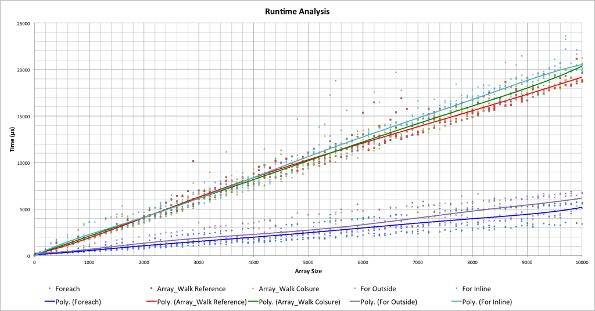
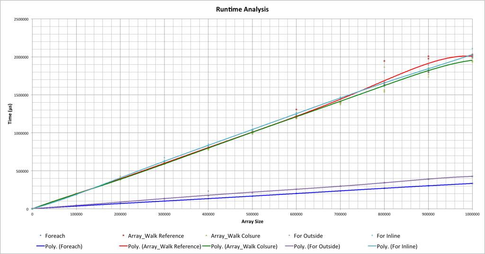
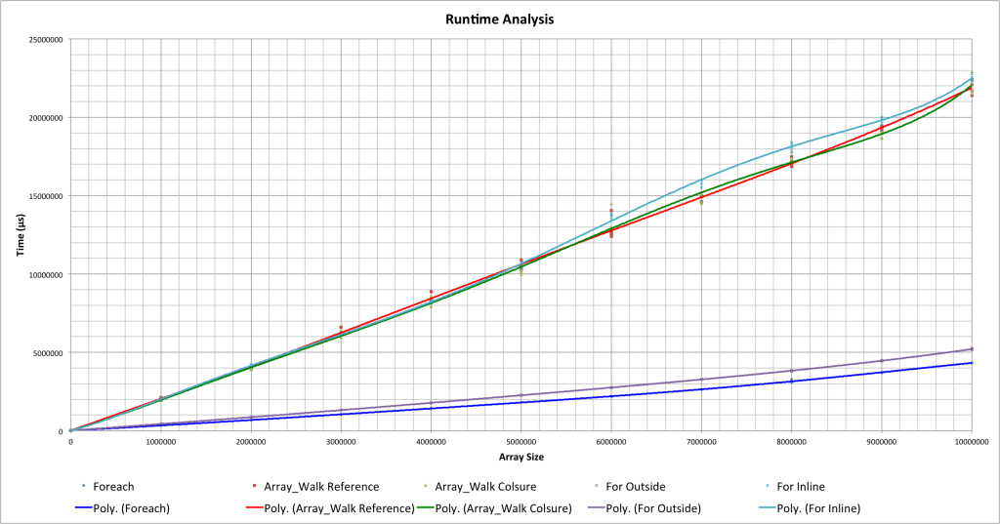

*UPDATE:* Migrated from a [post](https://web.archive.org/web/20140730180731/http://leve.rs:80/blog/benchmark-analysis-of-php-array-loops) I wrote when working on leve.rs

---

The last post I wrote provided examples of different ways to use array manipulation in PHP [Link](https://kernelcurry.com/blog/correct-array-manipulation-in-php/). An amazing number of people replied with a compelling argument, saying it’s better to use a foreach statement instead of the array_walk function.

As all comments I receive from my articles, I thought hard on the idea. What is the fastest way achieve the end result?

I decided to take 5 different methods and use [xhprof](http://pecl.php.net/package/xhprof) to collect runtime data. Then, I analyzed these results to determine the best method(s). All tests were executed using PHP 5.5.6 on a Macbook Air.

##### Methods

- Array_walk pass by reference
- Array_Walk closure function
- Foreach
- For with length set before loop
- For with length set inline

Each method used simple arithmetic functions to change each element in the array.

``` php{numberLines: false}
$element += 1000;
$element *= 2;
$element /= 10;
$element -= 200;
```

## Results
Each array size tested was calculated four separate times to eliminate outliers in the dataset. A trend line was then calculated for each method.



By analyzing the above graph, you will see there are 2 distinct groups: [For Inline, Array_Walk Reference, Array_Walk Closure] and [Foreach, For Outside]. Although visually there is a large difference between the two groups, there is actually only a millisecond difference in runtime. At this small of an array size, all tested methods are perfectly valid. This brings up a new question: What if the array was bigger?



Go figure; the graph looks the same! With this larger dataset, we can determine that all methods are acting in a linear fashion. Another proposition presents itself, making us ask, at what array size is using the faster group worth it?

##### Runtime Differences

*Group1:* [For Inline, Array_Walk Reference, Array_Walk Closure]

*Group2:* [Foreach, For Outside]

- Size 10,000: 161,000 µs
- Size 500,000: 849,000 µs
- Size 1,000,000: 1,679,000 µs

Just for fun, let’s take a look at a larger dataset.



Again, the graph looks similar. Now we’ll take a look at the time differences!

##### Runtime Differences

*Group1:* [For Inline, Array_Walk Reference, Array_Walk Closure]

*Group2:* [Foreach, For Outside]

- Size 5,000,000: 8,380,000 µs
- Size 10,000,000: 18,580,000 µs

## Conclusion
With small array sizes, any method can be used with no real consequences. That being said, a decision must be made for the point at which runtime difference matters. That point – for me – would be array size of 12,000. You will have to determine what your threshold is.

After analyzing the different methods, it is time for me to get into the Levers code base and clean up some things. I hope to see you on the other side, and with blazing speed!

## Code
#### Array Walk Reference

``` php{numberLines: false}
function calculate(&$element)
{
        $element += 1000;
        $element *= 2;
        $element /= 10;
        $element -= 200;
}

array_walk($subject, 'calculate');
```

#### Array Walk Closure

``` php{numberLines: false}
array_walk($subject, function(&$element){
        $element += 1000;
        $element *= 2;
        $element /= 10;
        $element -= 200;
});
```

#### For Outside

``` php{numberLines: false}
$len = count($subject);
for($i = 0; $i < $len; $i++)
{
        $subject[$i] += 1000;
        $subject[$i] *= 2;
        $subject[$i] /= 10;
        $subject[$i] -= 200;
}
```

#### For Inline

``` php{numberLines: false}
for($i = 0; $i < count($subject); $i++)
{
        $subject[$i] += 1000;
        $subject[$i] *= 2;
        $subject[$i] /= 10;
        $subject[$i] -= 200;
}
```

#### Foreach

``` php{numberLines: false}
foreach($subject as &$element)
{
        $element += 1000;
        $element *= 2;
        $element /= 10;
        $element -= 200;
}
```