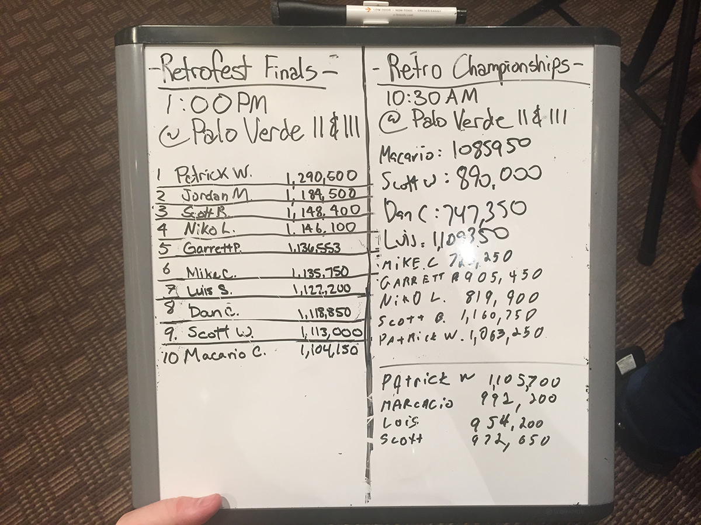
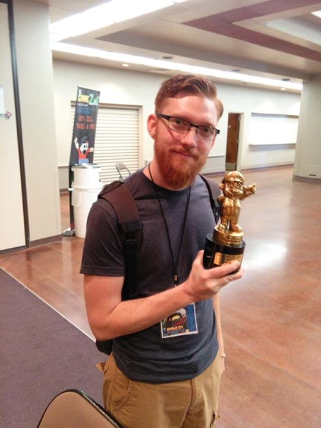

A few weekends ago, I flew into Arizona to attend the [Game On Retro Expo](https://gameonexpoaz.com/?utm_source=kernelcurry.com&utm_medium=referral&utm_campaign=nintendo-powerfest-1994-reunion-tournament "Game On Retro Expo]") with some old friends.  Among this group was Dorion Whitlock (1994 Nintendo PowerFest finalist and old roommate) and Mike Iarossi (1994 Nintendo PowerFest first place winner).  To say the least, I forgot how much fun it is playing video games with your friends.

The main draw for the Game On Retro Expo was the 1994 PowerFest Reunion Tournament.  Everyone at the expo was able to play a reproduction of the 1994 champion cartridge in hopes of qualifying for the Reunion tournament on Sunday.  This cartridge was time capped at about six minutes and consisted of the lost level in Mario, five laps in Mario Kart, and Ken Griffey Jr. Home Run Derby.  The top ten scoring players of the weekend qualified and the winner of the tournament played Mike Iarossi, the 1994 champion, on the real 1994 cartridge.

The first day, I was able to pull a score of 1.13 million, locking in my spot for the tournament on Sunday.  More about the tournament later.  For now, let’s talk about the 1994 Reunion Panel.

The panel consisted of Dorion, Mike, and Patric Wyrick.  Patric was also a finalist in the Nintendo 1994 PowerFest.  Stories of traveling around the U.S., qualifying friends and sabotaging a seven-year-old kid were all told.  But most importantly was the theme of how games used to be filled with a sense of wonder, frustration, and learning.  This being solidified by Mike Iarossi when he said, “… you only have one chance to learn something by yourself, why would you ruin that?”  I would recommend watching the full video for yourself.

`youtube: TGBHQYOvOgY` <figcaption>Nintendo Powerfest 94 Panel from GameOn Expo 2015</figcaption>

Finally it was Sunday: tournament day.  I placed 6th in the overall standings, and it was now time for the big boys to play.  The first few scores didn’t scare me, and I was pumped when my turn came around.  Making almost a perfect run on Mario, on the last mushroom, I jumped but apparently the controller did not agree with me, and ‘smack!’ I died!. Being about 15 seconds behind where I needed to be, I hit the quick-start on Mario Kart, boosting my spirits of making up some time.  Four laps in, I hit a pipe and ‘crash!’, there goes my game.  Finally getting to Ken Griffey Jr. Home Run, I had two pop fly pitches and only hit out 15 home runs.  Locking me into 9th place.  I choked! It happens, but it was a blast.

The first place winner was Patric.  Him and Mike Iarossi duked it out for pride and glory.  Starting with Patric, dying in Mario, taking a slow lap in Mario Kart and hitting more line drives than home runs, it looked as if the reigning champion had him beat even before he touched the controller.  Mike flew through Mario and schooled everyone in the room in Mario Kart.  With more time than anyone on the last game, it looked like it was in the bag, but the Nintendo Gods had other plans.  One after another, pop flys and line drives were the plague set upon Mike.  Patric took the victory ~840,000> to ~800,000.

All said and done, the weekend was amazing.  Bringing it back to the old times; playing video games, and just having a blast with new and old friends.  What more could anyone ask for?

Mike Iarossi is still going strong in his quest to play games and show others the advantages of playing them.  Take a look at his [website](https://qik1.com/?utm_source=kernelcurry.com&utm_medium=referral&utm_campaign=nintendo-powerfest-1994-reunion-tournament "qik1.com") or checkout his stream at [twitchTv/qik1](https://www.twitch.tv/qik1?utm_source=kernelcurry.com&utm_medium=referral&utm_campaign=nintendo-powerfest-1994-reunion-tournament "twitch.tv - qik1").  And make sure to give him a hard time for me.  But be prepared, if you egg him on, expect to take a few shots yourself.

Happy Gaming!