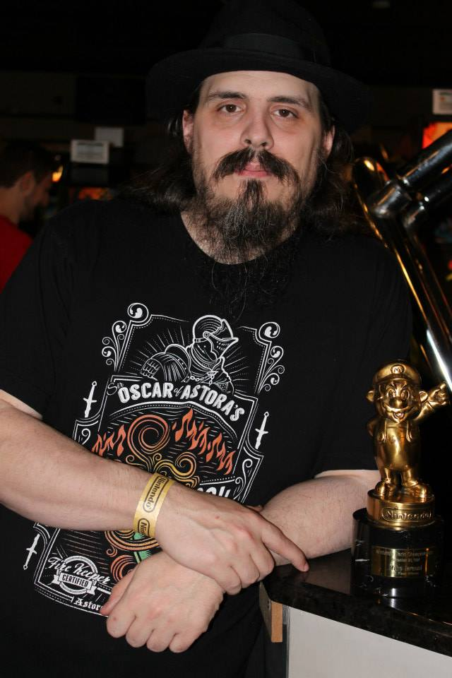

Lists of `Top X` or `Best Y` can very widely from person to person, but being the winner of the 1994 Nintendo Championship (PowerFest 94) in the 18+ category should give some klout right?! Below, Mike Iarossi outlines his top games from the past decade.  

#### 1. Dark Souls (2011) 2000+ hours
Demon's Souls was in 2009 and started From Software on the Souls series of games but in 2011 Dark Souls came out and it has since made a huge impact on the world of gaming. Countless games have tried to make their own version but few have even come close to this masterpiece. It's one of, if not the best, games of all time.

#### 2. The Last of Us (2013) 100+ hours
Naughty Dog practiced their narrative skills with the Uncharted series but took it to another level with The Last of Us. The game manages to take you on an incredibly satisfying journey that is very difficult to put down as the stakes are continually raised. This is one of the best written and acted games ever.

#### 3. Path of Exile (2013) 2000+ hours
When PoE launched in beta it showed a lot of promise but it wasn't very good gameplay wise. Diablo 3 was superior at the time with it's smooth gameplay. As time went on though Path of Exile honed it's gameplay and created a monster ARPG in the process. Diablo 3 fell to the side and PoE became the standard bearer for ARPG that will make it hard for any new ARPG to live up to. The amount of build customization is astounding.

#### 4. The Witness (2016) 40+ hours
Tetris might be known as the best puzzle game ever but I don't see Tetris as a puzzle game. This is an actual puzzle game. What seems like a simple premise reveals itself to much deeper levels as you progress. The way they teach you how things work so that you can solve more puzzle later is done with great effect. I truly miss playing this for the first time.

#### 5. Dark Souls 3 (2016) 500+ hours
The first Dark Souls might be what every souls like game is compared to but this game is From Software's masterpiece. The boss design is truly epic and unlike Dark Souls 2 created a world that was coherent. This team are some of the greatest world builders the industry has. Dark Souls 3 is just flat out great at being a Dark Souls game.

#### 6. Borderlands 2 (2012) 900+ hours
This was the series Hellgate tried to be, an actual looter shooter. The first Borderlands got the concept right but the second one made it great. Handsome Jack is a legendary villain and this game has insane amounts of replayability. It's one of the best co-op games ever made and is incredibly fun.

#### 7. Dragon's Dogma (2012) 300+ hours
When Capcom is at their best they can make really great games and this is a prime example of that. I played this game on 3 different systems. (360, PS3 and PC) The saddest part is that we never got a sequel.
 
#### 8. Bloodborne (2015) 300+ hours
After Dark Souls 2 disappointed Bloodborne came out and showed that From Software was still the best as what they do. Taking the Souls framework and putting it into a gothic victorian setting mixed with Lovecraft created an intense world that was a pleasure to explore. The boss design made several leaps forward for the genre here. Probably the best PS4 original there is.

#### 9. Tales of Berseria (2016) 100+ hours
I love the Tales series of games but Berseria is easily the best in recent memory. Velvet is a great character and the supporting cast also does well. It doesn't innovate the series in any meaningful way but the story anc characters made it the best since Vesperia or Symphonia. While this was a prequel to Zestiria is was good in all the was that Zestiria wasn't.

#### 10. Uncharted 4 (2016) 20+ hours
While Uncharted 2 will always be my favorite in the series, 4 is a worthy finale to the series. Uncharted is like playing an action movie. The levels are all grand sets in which spectacular scenes play out. The narrative here was really great as well. Graphically this is one of the best looking PS4 games. There is just a stunning amount of detail in much of the game.

#### 11. Super Mario 3D World (2013) 50+ hours
The first half of this game was so bland and mediocre that I was disappointed when I finished the story. what came after that is why the game is on this list. The amazing post game content here really showed why Nintendo's mainline Mario games are still the best platformers out there.

#### 12. Fallout: New Vegas (2010) 200+ hours
Fallout 3 is my favorite Fallout but that came out in the previous decade. New Vegas still did a great job but I always felt it added a bunch of unnecessary things. The writing here is top notch though and while the Courier storyline never quite lived up to expectations it's still an incredible game.

#### 13. The Binding of Isaac (2011) 100+ hours
Take the single screen gameplay of the original Zelda, add to that twin stick gameplay and then make it a rogue like. That description doesn't do justice to this game. You just have to play this one to be able to understand why it's so good.

#### 14. The Evil Within 2 (2017) 60+ hours
The best Resident Evil game ever made.

#### 15. The Outer Worlds (2019) 50+ hours
Better Fallout. Fallout 4 was a disappointment. The world was bland and uninteresting. It added building and annoying tower defense like bullshit. The Outer Worlds is made by the guys who made New Vegas. It has great writing and just focuses on being a good game that happens to be very similar to Fallout. It's pretty much Obsidian saying hey we'd love to make another actual Fallout game but Bethesda hates being 1-up'd at their own game so we made this instead.

#### 16. The Elder Scrolls V: Skyrim (2011) 200+ hours
As far as medievil fantasy open world games goes this is the top of the heap. Bethesda makes great stuff when they focus on the games and not their bottomline. they also make the buggiest games out there but they have a huge following and the community typically fixes all their shit for them when they are allowed to anyway(I'm looking at you FO76). Skyrim is the best of the Bethesda games and I can only hope Starfield and ES6 are not riddled with bullshit.
 
#### 17. Grim Dawn (2016) 300+ hours
These guys managed to make an ARPG that doesn't suck and has remained relevant for a long time. Great class systems and a fairly interesting world gave this game legs and allowed it to shine in the face of Diablo 3 and Path of Exile.

#### 18. Dead Cells (2017) 80+ hours
I need to put more time into this at some point but it's a fantastic rogue like 2d platformer with great replayability.

#### 19. Dragon Quest XI (2017) 100+ hours
Playing this in Japanese and English. Not the best in the series but still quite enjoyable. Games like this are few and far between these days so I'll take em when I can.

#### 20. Ni No Kuni (2011) 40+ hours
Studio Ghibli and Level 5 came together to make this memorable title for the PS3. The story was pretty solid and the gameplay added some monster capture gameplay in with some reimagined classic RPG combat. I only wish the sequel was as good.

#### 21. God of War (2018) 50+ hours
It seems like every major game series wants to incorporate a little Dark Souls gameplay into their struggling franchise. Assassins Creed has been doing it lately and God of War also did it with spectacular results. This was a truly epic journey with Kratos and his boy.

#### 22. Divinity: Original Sin II (2017) 100+ hours
This is classic CRPG stuff here. These guys made an incredible title with deep character class combinations and a great story. I can't wait to see what they are doing with Baldur's Gate 3.

#### 23. Nier: Automata (2017) 50+ hours
another game I want to play more. This game had issues with my video card when it first released and while I beat the initial story I never got to do the following stories which I know add to the overall arc. I'll get back to this someday but what I did play of it was really awesome.

#### 24. Super Mario Galaxy 2 (2010) 40+ hours
It seems like forever ago that I played this but I remember Galaxy 1 and 2 being so good. I enjoyed the most recent entry Odyssey but I didn't like having to retread levels to gain 100% completion. I didn't think that was a good addition to mainline Mario games. Galaxy 1 and 2 however are some of the best they ever did.

#### 25. Final Fantasy XIII-2 (2011) 80+ hours
The best Final Fantasy game since 9. The 13 series was rightfully panned by much of the community but 13-2 was fun for what it was. It has the best Final Fantasy Song ever with Crazy Chocobo and the end game boss fights were top notch. I just don't think there will ever be another FF game as good as 6 or 9.

#### 26. Dark Souls 2 (2014) 400+ hours
Dark Souls 2 is a mess of a game. The world doesn't make sense and the boss fights are mostly generic. The boss fights are also a mix of either this was too damn easy or this fight is bullshit. They added more enemies is boss fights just to create artificial difficulty instead of making actual challenging boss design. Half the fights were just a guy with a sword and the DLC was mostly forgettable. So why the fuck do I have it on this list? It's still a Dark Souls game and while it might be a bad Dark Souls game it's still better than most anything else you can play.

---

Author: Mike Iarossi - Nintendo PowerFest 1994 Champion